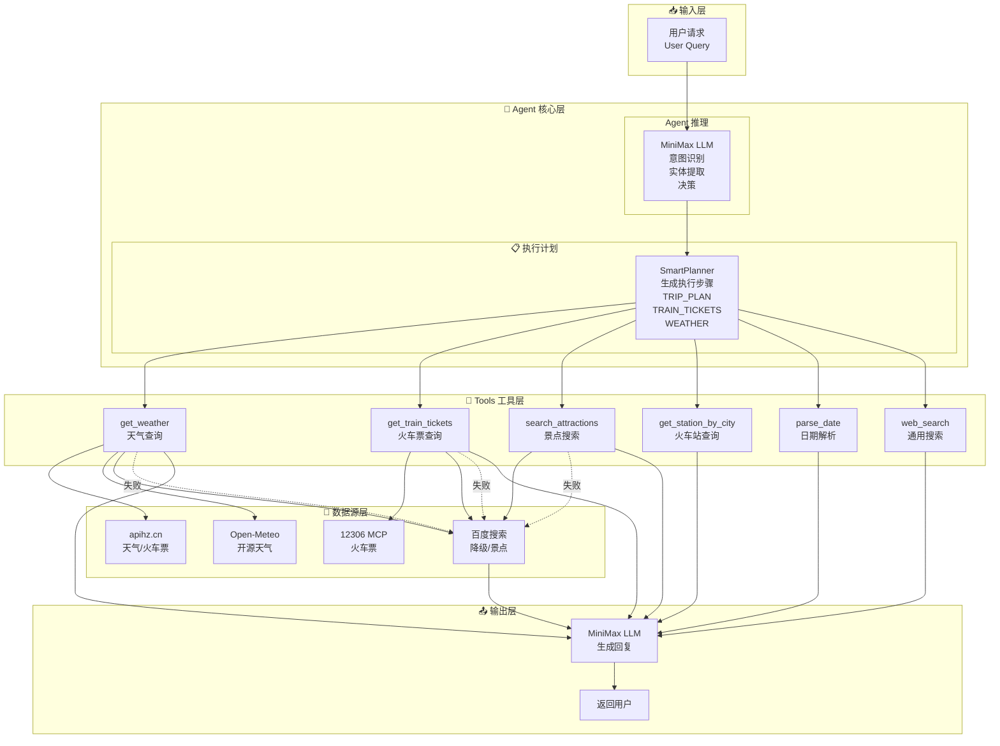
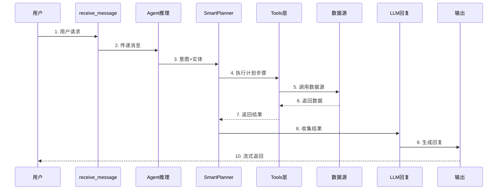

# 旅行规划智能体 - 完整 Agent 架构

## 完整架构图



## 执行流程时序图



## Agent 节点说明

| 节点名称 | 功能 | 说明 |
|----------|------|------|
| **receive** | 接收消息 | 记录用户输入，构建对话历史 |
| **reasoning** | Agent推理 | 调用 MiniMax LLM 进行意图识别、实体提取 |
| **plan** | 制定计划 | SmartPlanner 根据意图生成执行步骤 |
| **tools** | 执行工具 | 依次调用各个工具获取数据 |
| **respond** | 生成回复 | 调用 LLM 整合结果生成自然语言 |
| **fallback** | 降级搜索 | 工具失败时使用百度搜索兜底 |

## 数据流向

```
用户输入 
    ↓
LLM 意图识别 + 实体提取
    ↓
SmartPlanner 生成执行计划
    ↓
    ├→ get_weather → apihz.cn / Open-Meteo / 百度
    ├→ get_train_tickets → 12306 MCP / 百度
    ├→ search_attractions → 百度搜索
    ├→ get_station_by_city → 12306 MCP
    ├→ parse_date → 内置解析
    └→ web_search → 百度搜索
    ↓
LLM 生成回复
    ↓
返回用户
```

## 意图类型

| 意图 | 说明 | 工具调用 |
|------|------|----------|
| TRIP_PLAN | 旅行规划 | parse_date → get_weather → search_attractions → web_search |
| TRAIN_TICKETS | 火车票查询 | get_station_by_city → get_train_tickets |
| WEATHER | 天气查询 | get_weather |
| ATTRACTIONS | 景点推荐 | search_attractions |
| CAPABILITY | 能力查询 | 直接返回 |
| GENERAL | 通用搜索 | web_search |

## 降级策略

当主工具调用失败时，自动使用百度搜索降级：

- 天气查询失败 → 百度搜索天气
- 火车票查询失败 → 百度搜索火车票
- 景点搜索失败 → 百度搜索景点

---

**图片文件**: `langgraph_full_agent.png`
