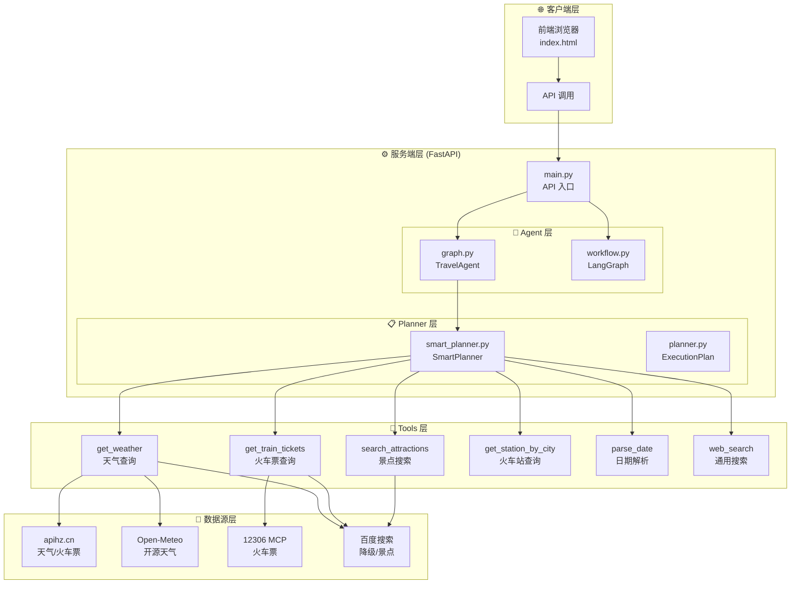
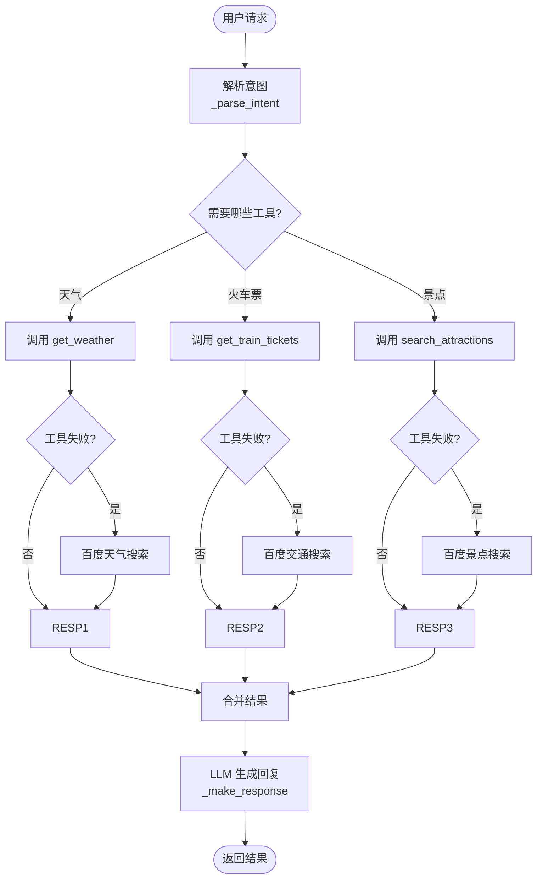
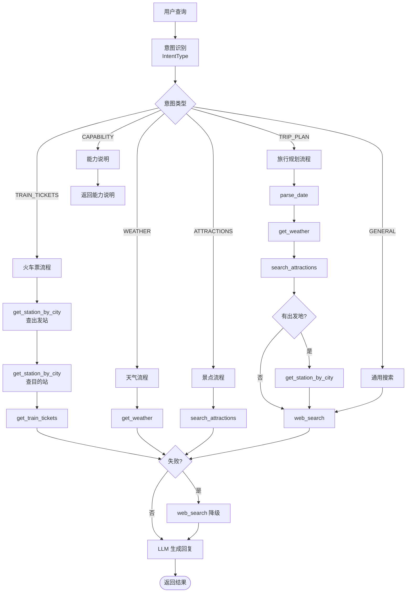
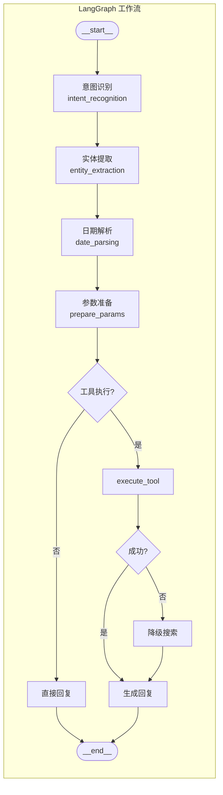
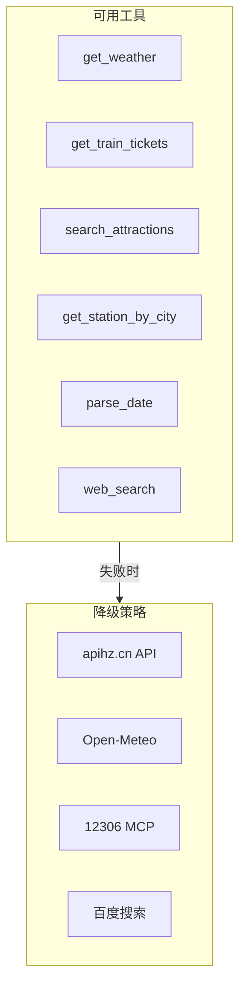
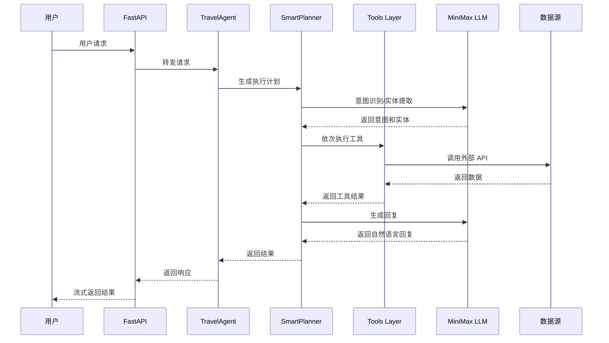
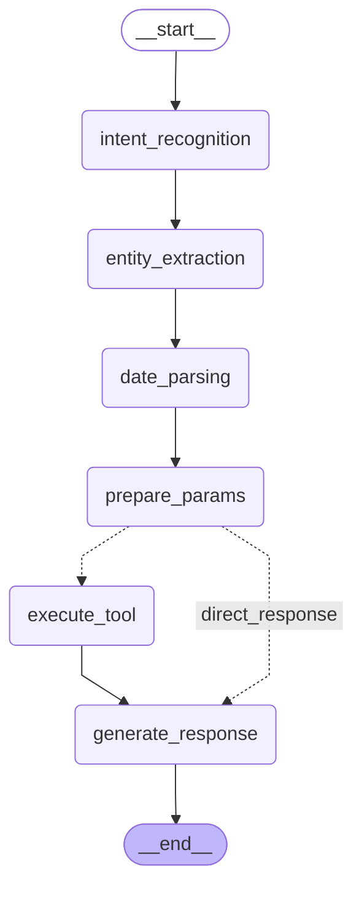

# 旅行规划智能体 - 完整架构

## 1. 整体系统架构

## 2. TravelAgent 执行流程 (graph.py)

## 3. SmartPlanner 工作流 (smart_planner.py)

## 4. LangGraph Workflow (workflow.py)

## 5. 工具链与降级策略

## 6. 数据流向图

## 7. LangGraph 详细图 (workflow.py)

